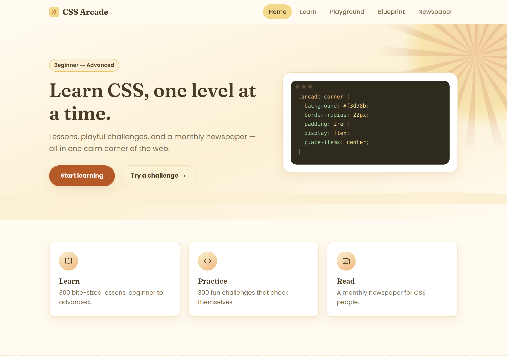
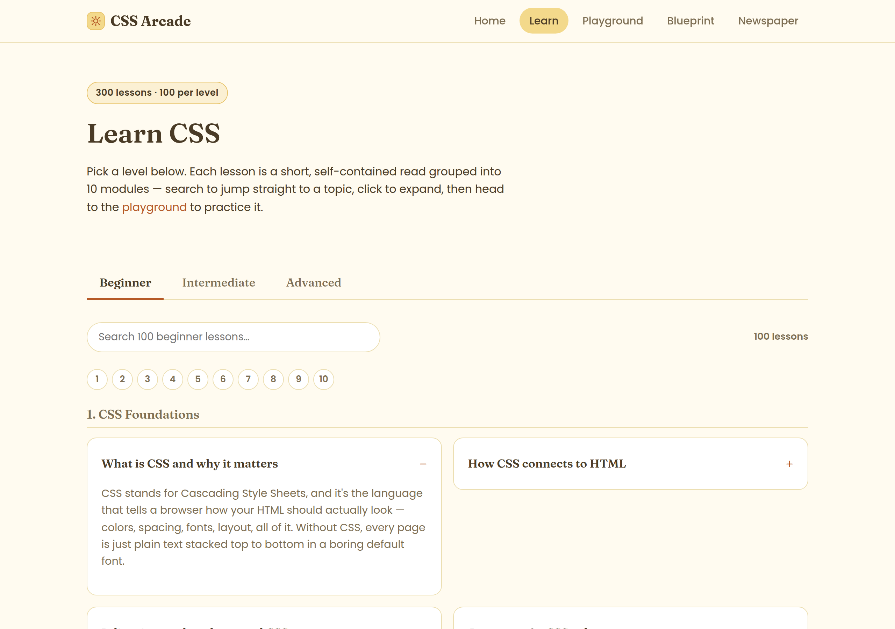
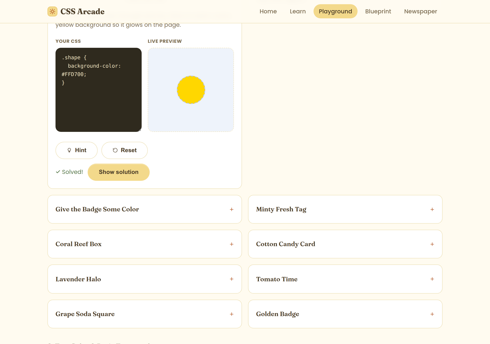
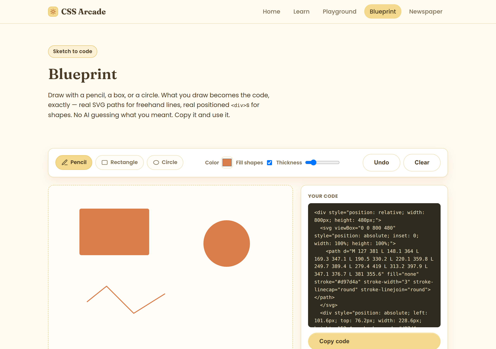
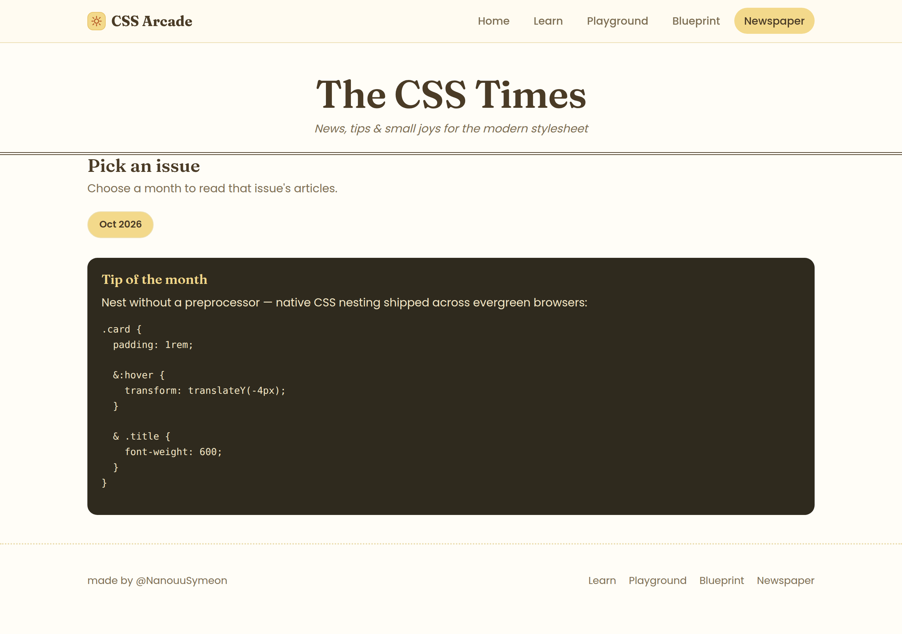

# CSS Arcade

A warm, minimal corner of the web built for one reason: to help people learn CSS and actually enjoy doing it. No accounts, no build step, no clutter — just lessons, small puzzles that check themselves, a sketch-to-code tool, and a newspaper for the CSS-curious.



## Why this exists

CSS gets a bad reputation as something you fight rather than something you learn. CSS Arcade tries to flip that: short lessons instead of dense docs, tiny self-checking puzzles instead of a wall of theory, and a butter-yellow, soft-retro look that feels more like a fun weekend project than a textbook. Beginner through advanced, the goal is the same — make CSS feel approachable and genuinely fun to get good at.

## What's inside

### Learn — 300 lessons

100 short, self-contained lessons per level (beginner, intermediate, advanced), grouped into 10 modules each. Search to jump straight to a topic, or browse module by module.



### Practice — 300 self-checking challenges

Small, specific CSS problems with a live editor and live preview side by side. Every challenge checks your actual rendered result — not just one "correct" answer — so any valid CSS technique that produces the right outcome counts as solved.



### Blueprint — sketch to real code

Draw with a pencil, a rectangle, or a circle tool. There's no AI guessing what you meant — freehand strokes become the exact SVG `<path>` you drew, and shapes become real, absolutely-positioned `<div>`s with real CSS (`width`, `height`, `background`, `border-radius`, and so on). The code panel updates live and there's a one-click copy button.



### Read — a monthly newspaper

"The CSS Times" — a print-styled newspaper. Pick an issue by month, read its articles, and a "Tip of the month" box stays visible while you're choosing.



## Running it locally

This is a fully static site — plain HTML, CSS, and JavaScript, no build step and no dependencies to install.

```bash
git clone https://github.com/supernanou/CCSPlayground.git
cd CCSPlayground
python3 -m http.server 8000
```

Then open `http://localhost:8000` in your browser.

## How the playground grades a challenge

Each challenge is checked against a small declarative rule engine (`js/rules-engine.js`) rather than a hardcoded expected answer. A challenge defines what should be true of the rendered result — a background color, a centered element, a `display: grid`, a `:hover` rule containing `transform`, and so on — and the engine verifies that against your actual CSS, live, in a sandboxed preview. That means there's rarely only one "correct" solution: flexbox or grid, whichever gets you there.

## Project structure

```
CCSPlayground/
├── index.html            Landing page
├── learn.html             Learn page (300 lessons)
├── playground.html        Playground page (300 challenges)
├── blueprint.html          Sketch-to-code tool
├── newspaper.html          The CSS Times
├── css/
│   └── style.css           All shared styling
└── js/
    ├── main.js               Nav + tab behavior
    ├── learn.js               Renders lessons, search, module navigation
    ├── playground.js          Renders challenges, editor, live preview, grading
    ├── blueprint.js            Drawing canvas + live code generation
    ├── newspaper.js            Issue picker / issue detail toggle
    ├── stages.js              Reusable markup/CSS "scenes" for challenges
    ├── rules-engine.js         Declarative rule checker for challenges
    ├── data-*.js               Lesson content (beginner/intermediate/advanced)
    └── challenges-*.js         Challenge content (beginner/intermediate/advanced)
```

## Credits

Made by [@NanouuSymeon](https://github.com/supernanou).
